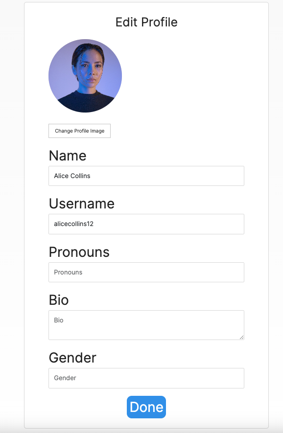
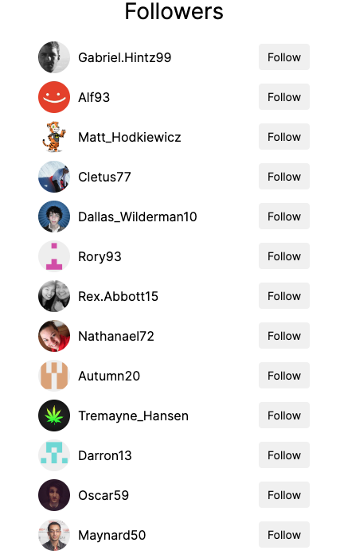

<!-- PROJECT LOGO -->
<br />
<p align="center">
  <a href="https://github.com/kacyphan7/instaVerse-react">
    
  </a>
<h2 align="center">InstaVerse (React)</h2>

<!-- TABLE OF CONTENTS -->
<details open="open">
  <summary>Table of Contents</summary>
  <ol>
    <li>
      <a href="#about-the-project">About The Project</a>
      <ul>
        <li><a href="#built-with">Built With</a></li>
        <li><a href="#built-with">How does InstaVerse work?</a></li>
        <li><a href="#built-with">Features of InstaVerse</a></li>
      </ul>
    </li>
    <li>
      <a href="#erd">ERD</a>
    </li>
    <li><a href="#wireframes">Wireframes</a></li>
    <li><a href="#screenshots">Screenshots</a></li>
    <li><a href="#future-enhancements">Future Enhancements</a></li>
    <li><a href="#attribution">Attribution</a></li>
    <li><a href="#license">License</a></li>
    <li><a href="#authors">Authors</a></li>

  </ol>
</details>

<!-- ABOUT THE PROJECT -->

# **About InstaVerse App**

InstaVerse is a photo social media application. The app allows users to view other users photos, upload/share their own photos. InstaVerse also allows users to view other users profile, like and comment on posts.

# **Built With**

- MERN Stack (MongoDB, Express, React, NodeJs)
- NextJS
- CSS
- Cloudinary

# How To Install
Setup requirements: 
`Node.js`, `Mongodb` 

1. `Fork` and `Clone` this respository to your local machine
2. Run `npm install` to install dependencies.
3. Run `npm run dev` or `npm start` to start server.
4. Open `http://localhost:3000` the web browser. 

# Additional Installations:

Faker
```
npm install --save-dev @faker-js/faker
```

Font Awesome
```
npm install @fortawesome/fontawesome-svg-core \
            @fortawesome/free-solid-svg-icons \
            @fortawesome/react-fontawesome
```

# **How does InstaVerse work?**
InstaVerse allows users to sign up for an account and log in. Once logged in, users can:

- View the home feed, which displays photos from other users.
- Upload and share their own photos.
- Like and comment on posts.
- Explore photos and profiles of other users.
- Customize their profile and settings.

# **Features of InstaVerse**
- User authentication and authorization.
- Home feed displaying photos from other users.
- Uploading and sharing photos.
- Liking and commenting on posts.
- User profiles with customization options.
- Explore feature to discover new content.

# **Screenshots**
## Login


## Signup


## Profile

## Post

## Profile Setting


## Followers


## Feeds


# **ERD**


# **Wireframes**


# **Future Enhancements**

- Private messaging feature.
- Explore feature with hashtags.
- Search functionality for users and content.
- Reels feature for short videos.
- Notifications for likes and comments.

# **Sources**
- [Faker](https://fakerjs.dev/guide/) - A library for generating fake data.
- [Font Awesome](https://fontawesome.com/v4/get-started/) - An iconic font and CSS toolkit.
- [Cloudinary](https://cloudinary.com/documentation/upload_images) - A cloud-based image and video management platform that provides image and video upload, storage, optimization, and delivery services.

# **License**

The source code for the site is licensed under the MIT license, which you can find in the MIT-LICENSE.txt file.

<h2 align="center">Authors</h2>

<div align="center">
  <a href="https://github.com/jaylee1021">
    
  </a>
    <a href="https://github.com/kacyphan7">
    
  </a>
</div>
